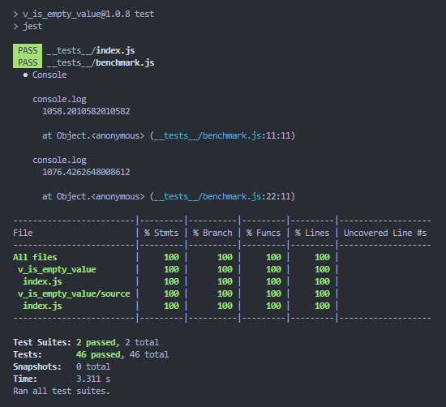

# 👨‍💻 v_is_empty_value
Simple checker for Empty/NotEmpty values. Checking Numbers, Null, NaN, Strings, Objects, Arrays...Will also detect instance of Date() object and return "not-empty" value for it.

🔩 Install using command :

    npm install v_is_empty_value

🎭 And save for later re-install :

    npm install v_is_empty_value --save

🪁 How to use:

    const { isEmpty, notEmpty } = require("v_is_empty_value");

    isEmpty()  //-> TRUE
    notEmpty()  //-> FALSE

    isEmpty("")  //-> TRUE
    notEmpty("")  //-> FALSE

    isEmpty(null)  //-> TRUE
    notEmpty(null)  //-> FALSE

    isEmpty(undefined)  //-> TRUE
    notEmpty(undefined)  //-> FALSE

    isEmpty(NaN)  //-> TRUE
    notEmpty(NaN)  //-> FALSE

    isEmpty({})  //-> TRUE
    notEmpty({})  //-> FALSE

    isEmpty([])  //-> TRUE
    notEmpty([])  //-> FALSE

    isEmpty("demo_password_123456")  //-> FALSE
    notEmpty("demo_password_123456")  //-> TRUE

    isEmpty(new Date())  //-> FALSE
    notEmpty(new Date())  //-> TRUE

## ✅ Test Results and Coverage with Jest

📑 Related links :
*   [v_to_md5](https://www.npmjs.com/package/v_to_md5) ⏭ MD5 hash generator
*   [v_to_sha256](https://www.npmjs.com/package/v_to_sha256) ⏭ sha256 hash generator
*   [v_file_system](https://www.npmjs.com/package/v_file_system) ⏭ simple and safe fs module with sync and promises
*   [v_execute](https://www.npmjs.com/package/v_execute) ⏭ Exec cli commands
*   [v_scrolls](https://www.npmjs.com/package/v_scrolls) ⏭ Readme Generator
*   [v_database](https://www.npmjs.com/package/v_database) ⏭ single database solution
*   [v_database_cli](https://www.npmjs.com/package/v_database_cli) ⏭ v_database cli tool